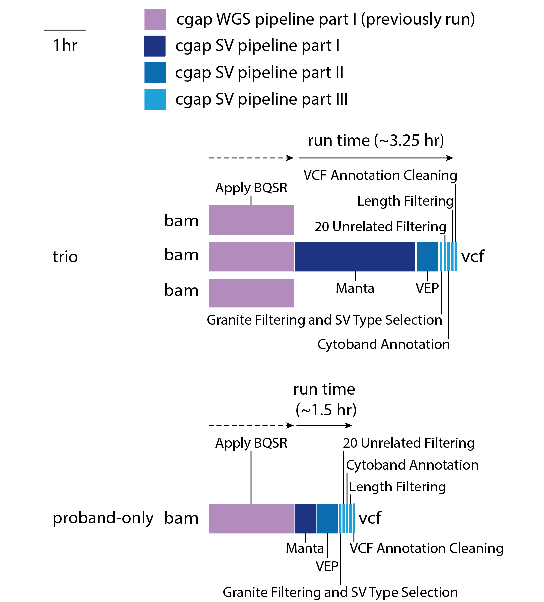

================
CGAP SV pipeline
================

CGAP SV pipeline identifies, annotates, and filters structural variants (SVs) starting from short read sequencing alignment files (``bam``) and produces ``vcf`` files as output.  SVs are a class of large genomic variants that includes deletions, duplications, translocations, inversions and other complex events, generally with a size of 50 bp or longer.

The pipeline is mostly based on ``Manta`` (https://github.com/Illumina/manta), ``ensembl-vep`` (https://github.com/Ensembl/ensembl-vep), ``sansa`` (https://github.com/dellytools/sansa), and ``granite`` (https://github.com/dbmi-bgm/granite).

The CGAP SV pipeline is designed for proband-only or trio analysis, with proband diagnosed with a likely monogenic disease. It receives the initial ``bam`` file(s) from the `CGAP WGS Pipeline <https://cgap-pipeline.readthedocs.io/en/latest/wgs.html>`_, which is optimized for data with 30x coverage and has been tested with data up to 80-90x coverage.

For proband-only analysis, a single ``bam`` file is provided to ``Manta`` and ``Single Diploid Sample Analysis`` is carried out, resulting in a ``vcf`` file containing SVs with genotypes for the proband.  For trio analysis, three ``bam`` files are provided to ``Manta`` and ``Joint Diploid Sample Analysis`` is carried out, resulting in a single ``vcf`` file containing SVs with genotypes for all three individuals.

The pipeline then performs annotation and filtering of SVs from that ``vcf`` file. ``vcf`` files are checked for integrity using ``vcftools`` ``vcf-validator`` at the end of any step during which they are created or modified.

Docker Images
#############

The current docker image for **SV calling** is ``cgap/cgap-manta:v2``

This image contains (but is not limited to) the following software packages:

- manta (1.6.0)
- samtools (1.7)
- bcftools (1.9)
- vcftools (0.1.17)

The current docker image for **annotation and filtering** is ``cgap/cnv:v2``

This image contains (but is not limited to) the following software packages:

- granite (0.1.13)
- bcftools (1.11)
- vep (101)
- sansa (0.0.8)
- vcftools (0.1.17)

SV Pipeline Flow
################

The overall flow and duration of the CGAP SV Pipeline is shown below:

SV Pipeline Parts and Runtimes
##############################

Largely, the pipeline consists of three parts:

  | Part 1. Beginning from ``bam`` files generated in ``Part 1`` of the `CGAP WGS Pipeline <https://cgap-pipeline.readthedocs.io/en/latest/wgs.html>`_, SVs are identified using ``Manta``
  | Part 2. Annotation of SVs with ``VEP`` for transcripts and ``sansa`` for gnomAD-SV allele frequencies
  | Part 3. Filtering of SVs to remove non-relevant variants, false positives, common variants, and very long variants

SV Pipeline Steps
#################

.. toctree::
   :maxdepth: 4

   sv-part1
   sv-part2
   sv-part3
